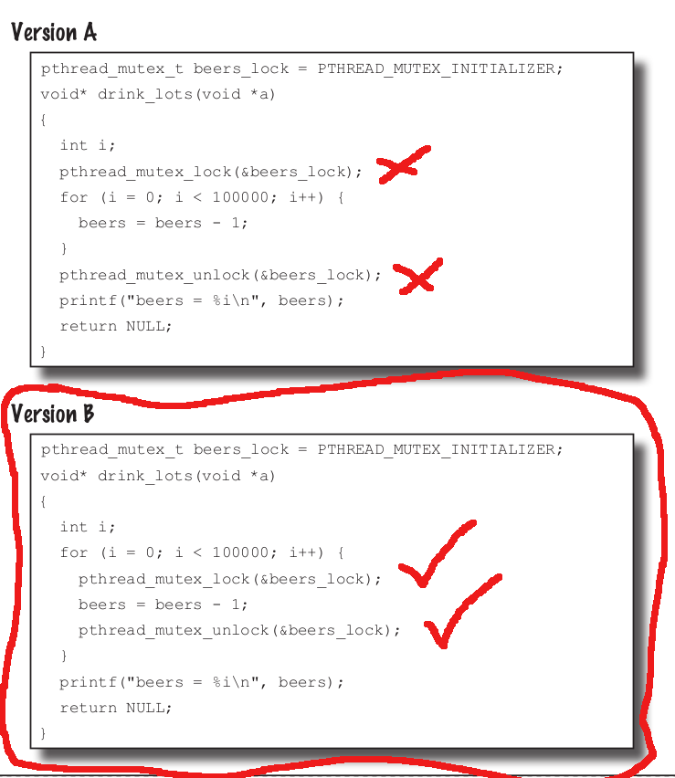

# It's a parallel world
## Threads


### Exercises
#### Beer Magnets
```c
#include <stdio.h>
#include <stdlib.h>
#include <pthread.h>

int beers = 2000000;

void* drink_lots(void* a)
{
    int i;
    for (i = 0; i < 100000; i++)
    {
        beers--;
    }

    return NULL;
}

int main(void)
{
    pthread_t threads[20];
    int t;

    printf("%i bottles of beer.\n", beers);

    for (t = 0; t < 20; t++)
    {
        pthread_create(threads[t], NULL, drink_lots, NULL);
    }
    void* result;

    for (t = 0; t < 20; t++)
    {
        pthread_join(threads[t], &result);
    }

    printf("There are now %i beers.\n", beers);

    return 0;
}

```

#### Brain power
The variable is not reduced to zero because multiple threads try to update it at
the same time and end up writing the wrong value;

#### Long exercise 

