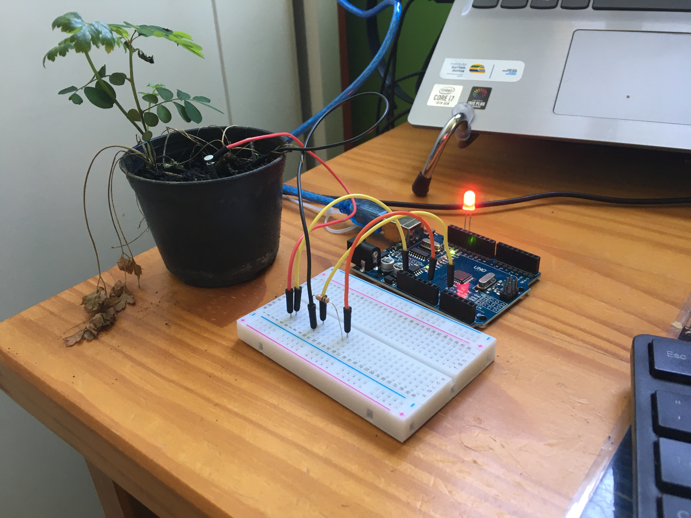
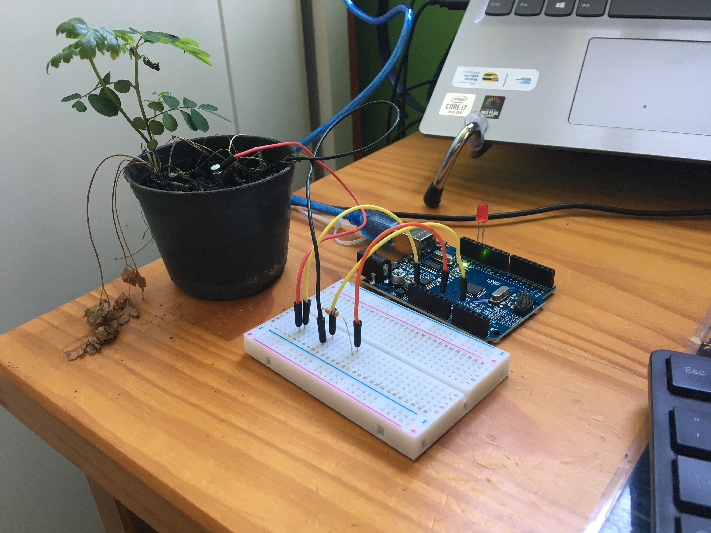

# C Lab 01: Arduino
## Talking house plant

### Project
Make an arduino that measures how wet your plant is. If the plant needs water, the
LED lights up. When the plant has been watered, the LED switches off. In borderline
conditions, the LED flashes;


### Physical Device
#### Components
- 1 Arduino
- 1 Solderless breadboard
- 1 LED
- 10K Ohm resistor
- 2 galvanized nails
- 3 short pieces of jumper wire
- 2 long pieces of jumper wire

### Code
After building the physical device, I've defined a **enum** for the three different
status of a plant: *DRY*, *BORDERLINE* and *GOOD*.

#### Types
```c
typedef enum status {DRY, BORDERLINE, GOOD};
```

Then I defined a struct pin to represent the variables of the LED:
```c
typedef struct _pin
{
    unsigned int on:1;
    int number;
    long counter;

} PIN;
```
The *bitfield* ``` on ``` represents the current status of the pin (on or off) and it is
modified by two functions ``` void turnon(void) ``` and ``` void turnoff(void)```
to switch the LED on and off.
The first int field, ``` number``` is the PIN number. In this case, 13.
The second int field, ``` counter``` is used by the ``` void blink(void)``` function to
flash the LED.

#### Functions

##### ``` void turnon(void)```

```c

// Set the on variable to true
void turnon()
{
    p.on = 1;

    Serial.println("Feed Me!\n");
    return;
}
```


##### ``` void turnoff(void)```
```c

// Set the on variable to false
void turnoff()  
{
    p.on = 0;
    return;
}

```


##### ```void blink(void)```
```c
// Switch the on variable each iteration
void blink()
{
    p.counter++;

    // Reset the counter to prevent buffer overflow
    if (p.counter >= 30000)
    {
        p.counter = 1;
    }

    // Turn on if counter is divisible by 2
    if (p.counter % 2 == 0)
    {
        turnon();
        return;
    }

    // Else, turn off
    turnoff();

    return;
}

```


#### Setup function
In the ```c void setup(void)``` function, I initialized the Serial to be able
to print text on the screen and defined the LED pin to OUTPUT.

In the ```c void loop(void)``` function, I first the voltage between the nails
using the ```analogRead(int a)``` function and passing the number 1 to read
the info about the pin A1.

#### Loop function
```c
    int voltage = analogRead(1);

```
Then I used a ``` enum status get_status(int a)``` function to return DRY when
the voltage is below 400, BORDERLINE between 400 and 550 and GOOD above 550;

```c

enum status get_status(int a)
{
    /* Given the small size of the plant,
        it is dry when the current is below 400 */
    if (a <= 400)
    {
        return DRY;
    }
    // Borderline between 400 and 550
    else if (a <= 550)
    {
        return BORDERLINE;
    }

    return GOOD;
}

```
In the loop function:
```c
    enum status current = get_status(voltage);
```

Switching the current variable, I then called the proper function to change the
LED on variable.
```c

    // Analise the status
    switch (current)
    {
        // If dry, turn on the LED
        case DRY:
        {
            turnon();
            break;
        }
        // If borderline, start to blink
        case BORDERLINE:
        {
            blink();
            break;
        }
        // If good, turn off
        case GOOD:
        {
            turnoff();
            // If the previous status wasn't good, says thank you
            if (prev != GOOD)
            {
                Serial.println("Thank you, Seymour!");
            }
            break;
        }
    }
```

For GOOD status, I checked the "prev" variable. If it wasn't GOOD, the it means
the plant was watered, and therefore should say thank you.

Finally, the changes are applied and the "prev" variable is updated. A 1 second
delay is set, finishing the loop declarations.

```c

    // Apply pin changes
    digitalWrite(p.number, p.on);

    // Update the current status
    prev = current;

    // One sec delay between updates
    delay(DELAY_TIME);
```
